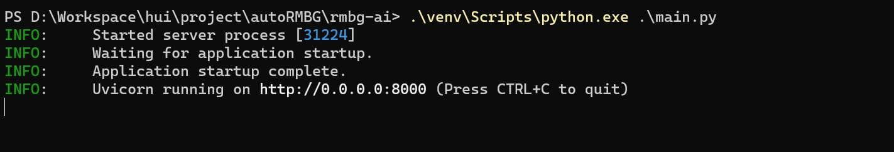
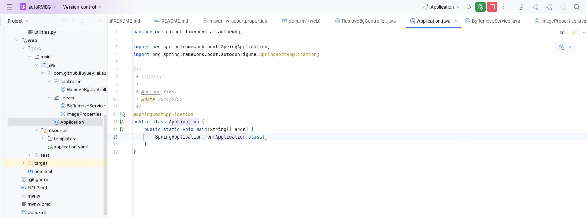

# autoRMBG

基于SpringBoot3.2.2 + jdk17 + Thymeleaf + WebClient + briaai/RMBG-1.4 实现的基于AI的自动抠图服务

## 启动方式

### 环境依赖

- python3.11
- jdk17
- maven3.6+

### 环境配置

1. brain提供的自动抠图AI初始化

[rmbg-ai服务安装](rmbg-ai/README.md)

2. jdk相关环境初始化

- 安装jdk，maven
- idea 加载项目，编译

### 启动服务

首先进入 rmbg-ai 启动服务

```bash
# mac/linux 环境
rmbg-ai/venv/bin/python rmbg-ai/main.py

# win 环境
.\rmbg-ai\venv\Scripts\python.exe .\rmbg-ai\main.py
```



接着启动SpringBoot应用



浏览器打开: [http://localhost:8080/](http://localhost:8080/)

实际体验效果如下：


