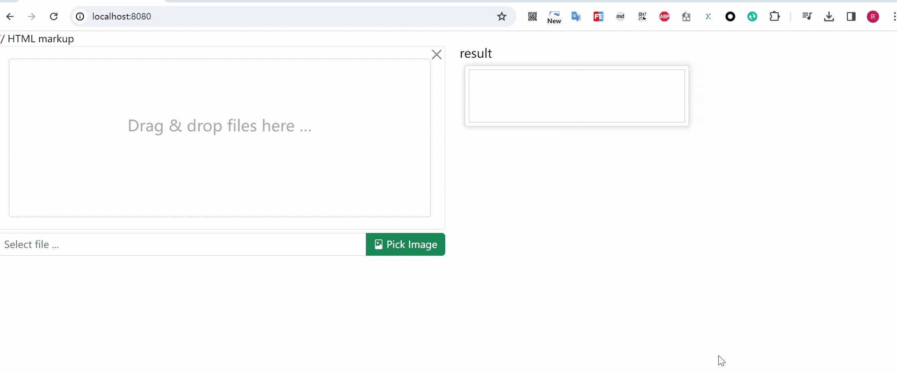

# autoRMBG

基于SpringBoot3.2.2 + jdk17 + Thymeleaf + WebClient + briaai/RMBG-1.4 实现的基于AI的自动抠图服务

## 系列教程

- [x] [从0到1实现一个自动抠图服务](./docs/md/从0到1实现一个自动抠图服务.md)
- [x] [基于webflux的web抠图服务](./docs/md/基于webflux的web抠图服务.md)

## 启动方式

### 技术栈

自动抠图服务，目前主要依赖两套技术栈，分别是基于python的AI模型执行过程与基于Java的WEB应用

**JAVA后端技术栈**: `JDK17` + `Maven` + `SpringBoot3.2.2`

基础组件：

|技术 | 说明 | 官网 |
|:----:| -------| ----------|
| Spring & SpringMVC & WebFlux | Java全栈应用程序框架和WEB容器实现 | [https://spring.io/](https://spring.io/) |
| SpringBoot| Spring应用集成开发框架 | [https://spring.io/projects/spring-boot](https://spring.io/projects/spring-boot) |
| https | 证书 | [https://letsencrypt.org/](https://letsencrypt.org/) |
| lombok | Java语言增强库  | [https://projectlombok.org](https://projectlombok.org)|
| guava | google开源的java工具集 | [https://github.com/google/guava](https://github.com/google/guava)|
| thymeleaf | html5模板引擎  | [https://www.thymeleaf.org](https://www.thymeleaf.org)|
| jackson | json/xml处理 | [https://www.jackson.com](https://www.jackson.com)|
| bootstrap-fileinput | 图片上传控件  | [https://github.com/kartik-v/bootstrap-fileinput](https://github.com/kartik-v/bootstrap-fileinput)|
| base-plugin | 文件处理| [https://github.com/liuyueyi/quick-media](https://github.com/liuyueyi/quick-media) |


**Python技术栈**: `python3.11` + `torch` + `fastapi`

基础组件:

| 技术 | 说明 | 官网 | 
|:----:| -------| ----------|
| torch | 深度学习框架 | [PyTorch](https://pytorch.org/) |
| Pillow | 图像操作 | [pillow · PyPI](https://pypi.org/project/pillow/) |
| NumPy | 科学计算基础包 | [NumPy -](https://numpy.org/) |
| huggingface_hub | huggingface模型包管理工具 | [Hugging Face – The AI community building the future.](https://huggingface.co/) |
| fastAPI | web框架 | [FastAPI](https://fastapi.tiangolo.com/) |


### 环境依赖

- python3.11
- jdk17
- maven3.6+

### 环境配置

1. brain提供的自动抠图AI初始化

[rmbg-ai服务安装](rmbg-ai/README.md)

2. jdk相关环境初始化

- 安装jdk，maven
- idea 加载项目，编译

### 启动服务

首先进入 rmbg-ai 启动服务

```bash
# mac/linux 环境
rmbg-ai/venv/bin/python rmbg-ai/main.py

# win 环境
.\rmbg-ai\venv\Scripts\python.exe .\rmbg-ai\main.py
```


接着启动SpringBoot应用


浏览器打开: [http://localhost:8080/](http://localhost:8080/)

实际体验效果如下：



