随着AI的大行其道，我们也来凑一个热闹，看一下如何搭建一个独属于自己的AI应用。 作为一个多年的java来说，首选的应用搭建框架当然继续是使用我们的java技术栈。接下来将手把手教你搭建一个基于AI的自动抠图服务

<!-- more -->

## 1. 技术栈与效果预览

### 1.1 技术栈

自动抠图服务，目前主要依赖两套技术栈，分别是基于python的AI模型执行过程与基于Java的WEB应用

**JAVA后端技术栈**: `JDK17` + `Maven` + `SpringBoot3.2.2`

基础组件：

|技术 | 说明 | 官网 |
|: ----:| -------| ----------|
| Spring & SpringMVC & WebFlux | Java全栈应用程序框架和WEB容器实现 | [https://spring.io/](https://spring.io/) |
| SpringBoot| Spring应用集成开发框架 | [https://spring.io/projects/spring-boot](https://spring.io/projects/spring-boot) |
| https | 证书 | [https://letsencrypt.org/](https://letsencrypt.org/) |
| lombok | Java语言增强库  | [https://projectlombok.org](https://projectlombok.org)|
| guava | google开源的java工具集 | [https://github.com/google/guava](https://github.com/google/guava)|
| thymeleaf | html5模板引擎  | [https://www.thymeleaf.org](https://www.thymeleaf.org)|
| jackson | json/xml处理 | [https://www.jackson.com](https://www.jackson.com)|
| bootstrap-fileinput | 图片上传控件  | [https://github.com/kartik-v/bootstrap-fileinput](https://github.com/kartik-v/bootstrap-fileinput)|
| base-plugin | 文件处理| [https://github.com/liuyueyi/quick-media](https://github.com/liuyueyi/quick-media) |


**Python技术栈**: `python3.11` + `torch` + `fastapi`

基础组件:

| 技术 | 说明 | 官网 | 
|: ----:| -------| ----------|
| torch | 深度学习框架 | [PyTorch](https://pytorch.org/) |
| Pillow | 图像操作 | [pillow · PyPI](https://pypi.org/project/pillow/) |
| NumPy | 科学计算基础包 | [NumPy -](https://numpy.org/) |
| huggingface_hub | huggingface模型包管理工具 | [Hugging Face – The AI community building the future.](https://huggingface.co/) |
| fastAPI | web框架 | [FastAPI](https://fastapi.tiangolo.com/) |


### 1.2 效果预览图

图片上传，实现自动抠图

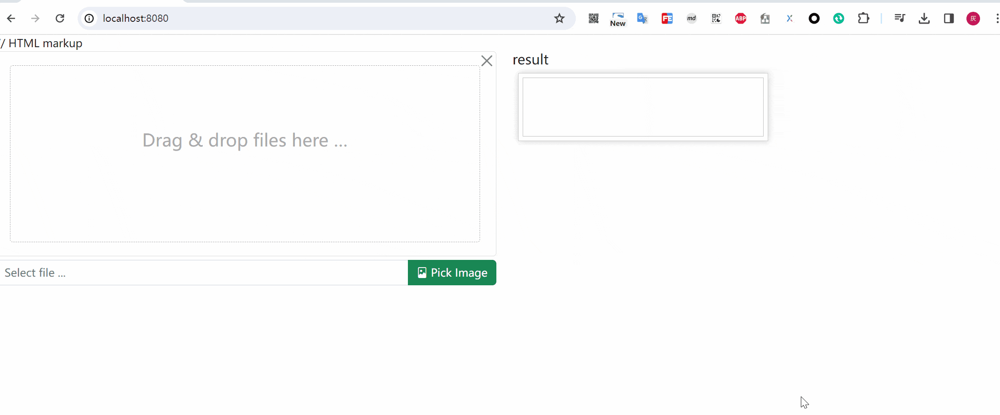


## 2. 基础环境准备

### 2.1 安装环境搭建

我们接下来的应用主要是基于python3 和 jdk17+来构建，因此基础的系统环境需要提前准备完毕

- [ ] python3.11 安装
- [ ] java17+ 安装
- [ ] maven环境配置

(具体的安装相关逻辑省略)


### 2.2 项目创建

我们直接再Spring的初始化页面中创建项目

进入网址：[https://start.spring.io/](https://start.spring.io/)

如下配置：

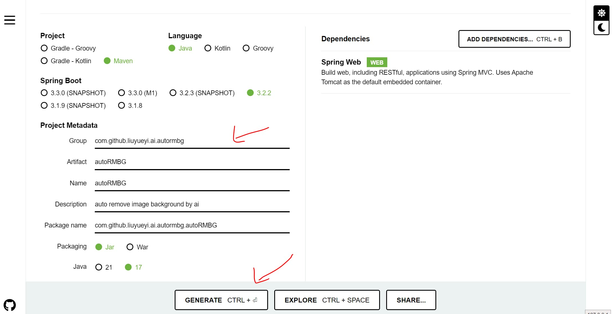


生成之后，将项目导入IDEA，然后新建一个web module


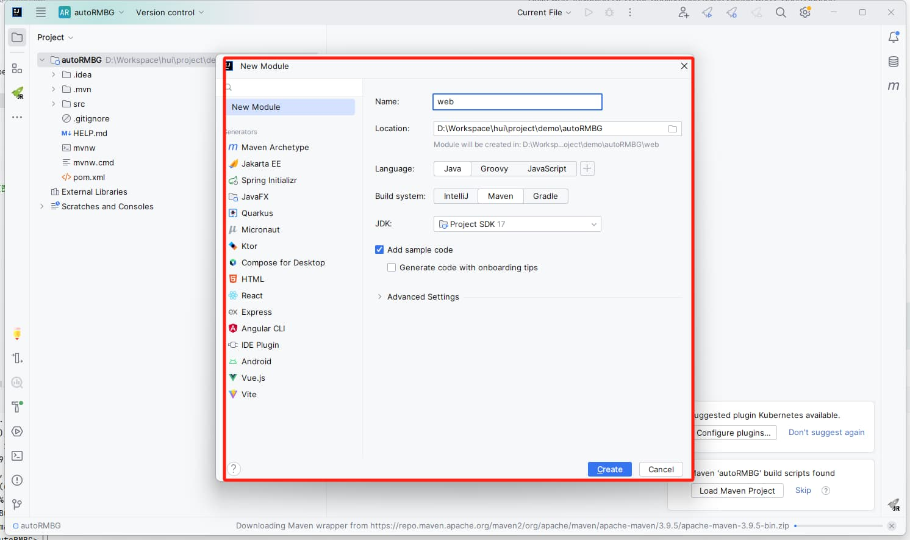


然后新建一个文件夹，命名为`rmbg-ai`，将python对应的模型执行应用下载进去

> 自动抠图AI模型 [https://huggingface.co/briaai/RMBG-1.4](https://huggingface.co/briaai/RMBG-1.4)

```bash
git clone https://huggingface.co/briaai/RMBG-1.4 rmbg-ai
```

我们只需要其中几个关键的python类，若上面的clone执行不成功，可以只拷贝下面几个


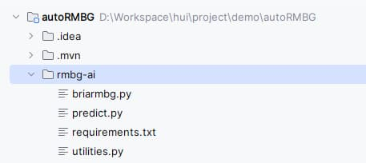


设置python执行环境，安装依赖:

```bash
python3.11 -m venv venv

.\venv\Scripts\pip.exe install -r .\requirements.txt  -i https://pypi.tuna.tsinghua.edu.cn/simple
```

linux/mac 环境安装

```bash
python3.11 -m venv venv

./venv/bin/python3 install -r ./requirements.txt  -i https://pypi.tuna.tsinghua.edu.cn/simple
```


### 2.3 AI模型启动


接下来我们先将抠图的AI模型跑通，先整一个demo （直接使用源码中的 
[example_inference.py](https://huggingface.co/briaai/RMBG-1.4/blob/main/example_inference.py)）

```python
import os
import sys

import torch
from PIL import Image
from huggingface_hub import hf_hub_download
from skimage import io

from briarmbg import BriaRMBG
from utilities import preprocess_image, postprocess_image


def example_inference(input_img: str, img_type="jpg", out_img_suffix="_no_bg.png"):
    model_path = hf_hub_download("briaai/RMBG-1.4", 'model.pth')
    print("model_path ==> ", model_path)
    im_path = f"{os.path.dirname(os.path.abspath(__file__))}/resource/{input_img}.{img_type}"

    net = BriaRMBG()
    device = torch.device("cuda" if torch.cuda.is_available() else "cpu")
    net.load_state_dict(torch.load(model_path, map_location=device))
    net.to(device)
    net.eval()

    # prepare input
    model_input_size = [1024, 1024]
    orig_im = io.imread(im_path)
    orig_im_size = orig_im.shape[0:2]
    image = preprocess_image(orig_im, model_input_size).to(device)

    # inference 
    result = net(image)

    # post process
    result_image = postprocess_image(result[0][0], orig_im_size)

    # save result
    pil_im = Image.fromarray(result_image)
    no_bg_image = Image.new("RGBA", pil_im.size, (0, 0, 0, 0))
    orig_image = Image.open(im_path)
    no_bg_image.paste(orig_image, mask=pil_im)
    save_file_name = f"{os.path.dirname(os.path.abspath(__file__))}/output/{input_img}{out_img_suffix}"
    no_bg_image.save(save_file_name)
    print("图片处理完成!")
    return save_file_name


if __name__ == "__main__":
    # # 命令行方式执行
    # # .\venv\Scripts\python.exe .\example_inference.py dog jpg oo
    # argv = sys.argv
    # file_name = argv[1]
    # if len(argv) > 2:
    #     file_type = argv[2]
    # else:
    #     file_type = "jpg"

    # if len(argv) > 3:
    #     out_suffix = argv[3]
    # else:
    #     out_suffix = "_no_bg"
    # print("命令行方式执行!")
    # example_inference(file_name, file_type, out_suffix)

    example_inference("giraffe")
```

再resource资源文件中，准备一张用于测试验证的资源图，将抠图的结果保存再output文件夹中


验证一下模型是否可以正常使用

```bash
# mac/linux
venv/bin/python3 demo.py

# win
.\venv\Scripts\python.exe .\demo.py
```

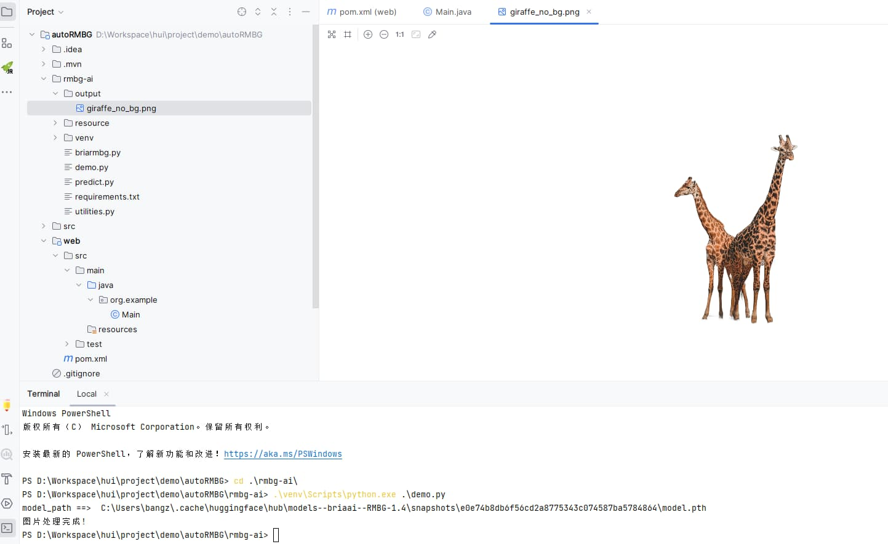


基于上面demo.py的方式，我们可以对外提供一个命令行方式的自动抠图服务，除此之外，我们也可以借助FastAPI来构建一个python的web应用，来实现抠图

简单的将按上面的demo逻辑封装一下，提供一个get接口

```python
import os
import sys

import torch
from PIL import Image
from huggingface_hub import hf_hub_download
from skimage import io

from briarmbg import BriaRMBG
from utilities import preprocess_image, postprocess_image


def remove_img_bg(input_img: str, img_type="jpg", out_img_suffix="_no_bg.png"):
    model_path = hf_hub_download("briaai/RMBG-1.4", 'model.pth')
    print("ai model model_path ==> ", model_path)
    # 传入的绝对路径
    abs_file = input_img.startswith("/") or input_img.find(":") > 0
    if abs_file:
        im_path = f"{input_img}.{img_type}"
    else:
        im_path = f"{os.path.dirname(os.path.abspath(__file__))}/resource/{input_img}.{img_type}"

    net = BriaRMBG()
    device = torch.device("cuda" if torch.cuda.is_available() else "cpu")
    net.load_state_dict(torch.load(model_path, map_location=device))
    net.to(device)
    net.eval()

    # prepare input
    model_input_size = [1024, 1024]
    orig_im = io.imread(im_path)
    orig_im_size = orig_im.shape[0:2]
    image = preprocess_image(orig_im, model_input_size).to(device)

    # inference 
    result = net(image)

    # post process
    result_image = postprocess_image(result[0][0], orig_im_size)

    # save result
    pil_im = Image.fromarray(result_image)
    no_bg_image = Image.new("RGBA", pil_im.size, (0, 0, 0, 0))
    orig_image = Image.open(im_path)
    no_bg_image.paste(orig_image, mask=pil_im)
    if abs_file:
        save_file_name = f"{input_img}{out_img_suffix}"
    else:
        save_file_name = f"{os.path.dirname(os.path.abspath(__file__))}/resource/{input_img}{out_img_suffix}"
    no_bg_image.save(save_file_name)
    print(f"图片处理完成! -> {save_file_name}")
    return save_file_name


from fastapi import FastAPI

app = FastAPI()

"""
通过下面的方式来实现抠图
http://localhost:8000/rmbg?name=dog&type=jpg
"""
@app.get('/rmbg')
def remove_background(name: str, type="jpg", outSuffix="_no_bg.png"):
    print(f"img_name: {name}.{type}")
    ans = remove_img_bg(name, type, outSuffix)
    return ans

if __name__ == "__main__":
    # http 方式执行
    import uvicorn
    
    uvicorn.run(app=app,
                host="0.0.0.0",
                port=8000,
                workers=1)
```

直接通过浏览器访问 [http://localhost:8000/rmbg?name=dog&type=jpg](http://localhost:8000/rmbg?name=dog&type=jpg) 来实现默认资源的抠图，表现结果如下


## 3. WEB应用构建

接下来我们来创建一个基于SpringBoot3.2.2的web应用，来实现自动抠图，其基本功能就是图片上传，后端实现抠图，并将结果返回给前端进行展示

### 3.1 web应用搭建

首先我们基于SpringMVC创建一个基础的web应用，借助Thymeleaf来实现模板渲染，再`pom.xml`中添加核心依赖

```xml
<dependencies>
    <dependency>
        <groupId>org.springframework.boot</groupId>
        <artifactId>spring-boot-starter-thymeleaf</artifactId>
    </dependency>
    <dependency>
        <groupId>org.projectlombok</groupId>
        <artifactId>lombok</artifactId>
    </dependency>
    <dependency>
        <groupId>org.springframework.boot</groupId>
        <artifactId>spring-boot-starter-web</artifactId>
    </dependency>
</dependencies>
```

再配置文件`application.yml`中，添加对Thymeleaf的相关配置

```yaml
spring:
  thymeleaf:
    cache: false
    encoding: UTF-8
    servlet:
      content-type: text/html
    mode: HTML5
```

再资源路径下，添加一个基础的html页面，后端写一个对应的视图访问接口，先让我们的web应用跑起来

前端资源文件 `templates/index.html`

```html
<!DOCTYPE html>
<html>
<head>
    <meta charset="utf-8">
    <meta name="viewport"
          content="width=device-width, height=device-height, user-scalable=no, initial-scale=1.0, minimum-scale=1.0, maximum-scale=1.0">
    <meta name="format-detection" content="telephone=no">
    <title>图片背景移除</title>
</head>
<body>

<h1>自动抠图视图</h1>
</body>
</html>
```

后端视图访问接口`com.github.liuyueyi.ai.autormbg.controller.RmBgView`

```java
@Slf4j
@Controller
public class RmBgView {
    /**
     * 移除图片背景视图
     *
     * @return
     */
    @GetMapping(path = {"", "/", "/index"})
    public String index() {
        return "index";
    }

}
```

启动访问示例

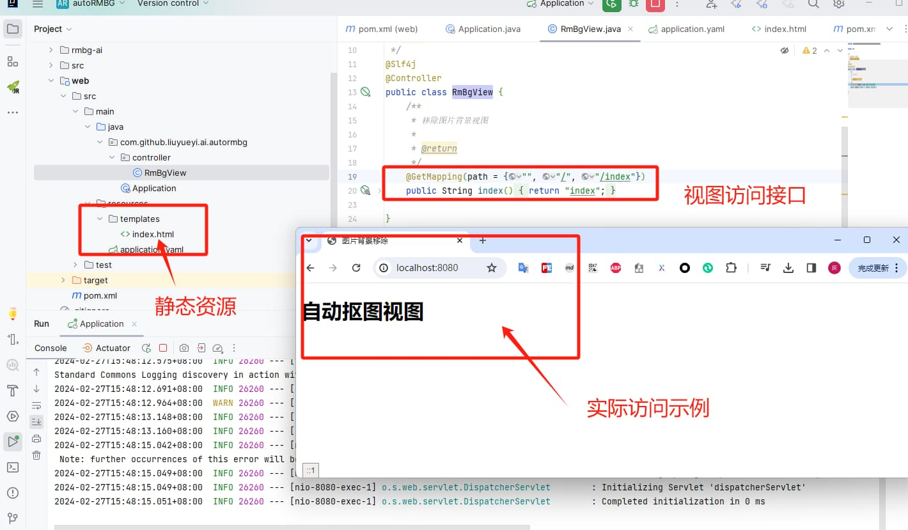

### 3.2 前端图片上传页面实现

接下来我们再现在的web应用基础上，先来实现前台页面的设计，页面主要元素为一个上传图片的控件及返回结果的展示区域

对于图片上传，我们这里直接使用 [kartik-v/bootstrap-fileinput](https://github.com/kartik-v/bootstrap-fileinput)

```html
<!DOCTYPE html>
<html>
<head>
    <meta charset="utf-8">
    <meta name="viewport"
          content="width=device-width, height=device-height, user-scalable=no, initial-scale=1.0, minimum-scale=1.0, maximum-scale=1.0">
    <meta name="format-detection" content="telephone=no">
    <title>图片背景移除</title>
    <!-- bootstrap 5.x or 4.x is supported. You can also use the bootstrap css 3.3.x versions -->
    <link rel="stylesheet" href="https://cdn.jsdelivr.net/npm/bootstrap@5.2.0/dist/css/bootstrap.min.css"
          crossorigin="anonymous">

    <!-- default icons used in the plugin are from Bootstrap 5.x icon library (which can be enabled by loading CSS below) -->
    <link rel="stylesheet" href="https://cdn.jsdelivr.net/npm/bootstrap-icons@1.5.0/font/bootstrap-icons.min.css"
          crossorigin="anonymous">

    <!-- alternatively you can use the font awesome icon library if using with `fas` theme (or Bootstrap 4.x) by uncommenting below. -->
    <!-- link rel="stylesheet" href="https://use.fontawesome.com/releases/v5.15.4/css/all.css" crossorigin="anonymous" -->

    <!-- the fileinput plugin styling CSS file -->
    <link href="https://cdn.jsdelivr.net/gh/kartik-v/bootstrap-fileinput@5.5.2/css/fileinput.min.css" media="all"
          rel="stylesheet" type="text/css"/>

    <!-- if using RTL (Right-To-Left) orientation, load the RTL CSS file after fileinput.css by uncommenting below -->
    <!-- link href="https://cdn.jsdelivr.net/gh/kartik-v/bootstrap-fileinput@5.5.2/css/fileinput-rtl.min.css" media="all" rel="stylesheet" type="text/css" /-->

    <!-- the jQuery Library -->
    <script src="https://code.jquery.com/jquery-3.6.0.min.js" crossorigin="anonymous"></script>

    <!-- piexif.min.js is needed for auto orienting image files OR when restoring exif data in resized images and when you
        wish to resize images before upload. This must be loaded before fileinput.min.js -->
    <script src="https://cdn.jsdelivr.net/gh/kartik-v/bootstrap-fileinput@5.5.2/js/plugins/piexif.min.js"
            type="text/javascript"></script>

    <!-- bootstrap.bundle.min.js below is needed if you wish to zoom and preview file content in a detail modal
        dialog. bootstrap 5.x or 4.x is supported. You can also use the bootstrap js 3.3.x versions. -->
    <script src="https://cdn.jsdelivr.net/npm/bootstrap@5.2.0/dist/js/bootstrap.bundle.min.js"
            crossorigin="anonymous"></script>

    <!-- the main fileinput plugin script JS file -->
    <script src="https://cdn.jsdelivr.net/gh/kartik-v/bootstrap-fileinput@5.5.2/js/fileinput.min.js"></script>

</head>
<body>
<!-- name 指定的表示传递给后端的文件参数名 -->
<div class="row">
    <div class="col-6">
        <input id="input-id" name="img" type="file" accept="image/*">
    </div>
    <div class="col-6">
        <div class="card-body">
            <h5 class="card-title">result</h5>
            
        </div>
    </div>
</div>


<script>
    $(document).ready(function () {
        $("#input-id").fileinput({
            previewFileType: "image",
            browseClass: "btn btn-success",
            browseLabel: "Pick Image",
            browseIcon: "<i class=\"bi-file-image\"></i> ",
            removeClass: "btn btn-danger",
            removeLabel: "Delete",
            removeIcon: "<i class=\"bi-trash\"></i> ",
            uploadClass: "btn btn-info",
            uploadLabel: "Submit",
            uploadIcon: "<i class=\"bi-upload\"></i> ",
            uploadUrl: "/upload/sync/rmbg", // 上传的url
            uploadAsync: true, // 异步上传
        }).on("fileuploaded", function (event, data) { //异步上传成功后回调
            console.log("返回结果:", data);		//data为返回的数据
            const res = data.response;
            $('#output').attr("src", res.url);
        });
    });
</script>
</body>
</html>
```

直接使用fileinput控件来实现本地图片的选择或者拖拽，后台接收图片上传的接口定义为`/upload/sync/rmbg`，其中图片的参数名为input标签的name属性值`img`

其次当后端返回结果之后，会触发上面js中的on方法回调，将返回结果中的抠图之后的图片url回写到output标签上，用于显示抠图结果

更新之后的前端样式如下:

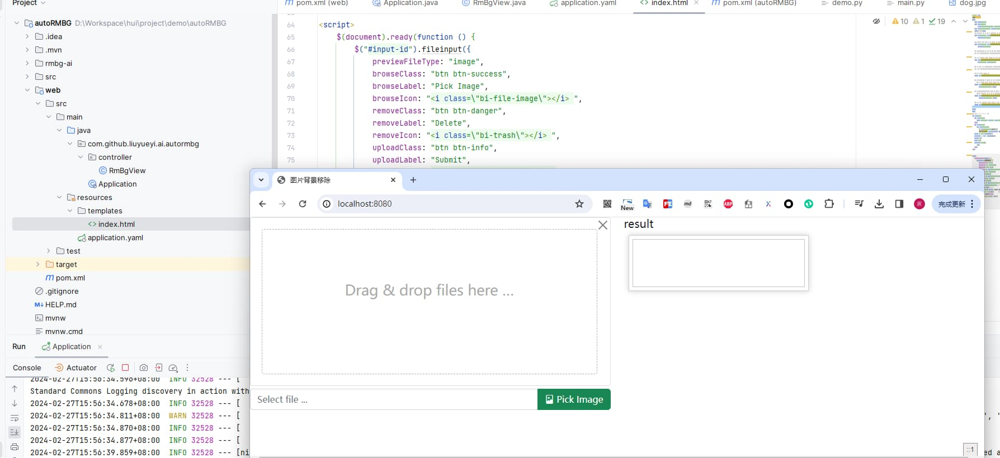


### 3.3 后端上传图片接收端点

接下来我们需要实现前端上传图片的后台接口，接收前台上传图片，转存本地，调用Python的抠图服务实现自动抠图，然后将结果返回给前端


首先定义返回的对象，内部包含处理后的图片地址

`com.github.liuyueyi.ai.autormbg.model.ImgRemoveRes`

```java
package com.github.liuyueyi.ai.autormbg.model;

import lombok.AllArgsConstructor;
import lombok.Data;
import lombok.NoArgsConstructor;

@Data
@AllArgsConstructor
@NoArgsConstructor
public class ImgRemoveRes {
    private String url;
}
```

前端交互接口定义与实现 `com.github.liuyueyi.ai.autormbg.controller.RmBgSyncRest`

```java
@Slf4j
@RestController
public class RmBgSyncRest {
    @Autowired
    private BgRemoveService bgRemoveService;

    /**
     * 移除图片背景的功能接口实现
     *
     * @param request
     * @return
     * @throws IOException
     */
    @ResponseBody
    @RequestMapping(path = "upload/sync/rmbg")
    public ImgRemoveRes rmBg(MultipartHttpServletRequest request) throws IOException {
        StopWatch stopWatch = new StopWatch();
        stopWatch.start("抠图");
        MultipartFile file = request.getFile("img");

        // todo 实现抠图
        String rmBgImgUrl = bgRemoveService.removeBg(file);

        stopWatch.stop();
        log.info("抠图耗时: {}ms", stopWatch.getTotalTimeMillis());
        return new ImgRemoveRes(rmBgImgUrl);
    }
}
```


接下来的核心逻辑就在于抠图的实现


### 3.4 抠图服务实现

首先确认抠图服务的核心逻辑，我们接收的是前端上传的文件流，我们需要干的事情就是将这个图片传递到Python服务进行抠图，然后拿到处理后的图片，返回给前端


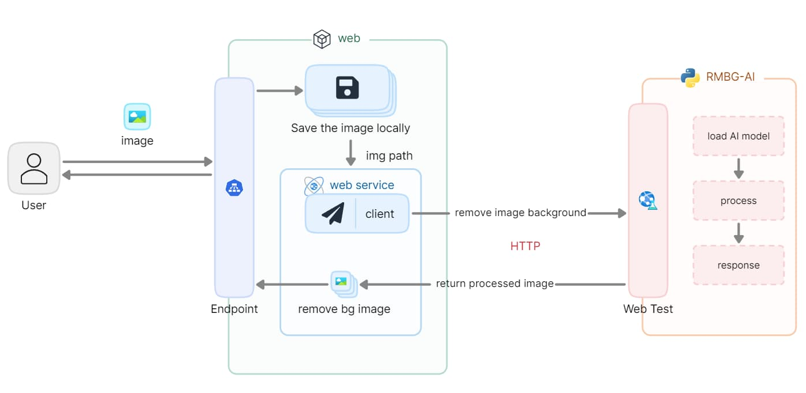

从上面的交互可以看出，核心逻辑有两块

- 保存上传图片
- 调用Python AI抠图，获取返回结果


我们这一期的实现中，java的web应用与python位于同一个实例，因此我们直接将上传的图片保存到本地，然后通过本地路径传递给python服务进行抠图处理；若两个应用分开，则可以考虑借助oss来实现图片存储，拿oss的访问地址进行交互


#### 3.4.1 图片存储

我们先实现一个图片存储再本地的逻辑，基本功能比较简单，将上传的io流，写入到本地文件中；我们需要考虑的就是保存再什么路径，怎么命名，如果对应的文件夹不存在则需要自动创建等功能点

这里我们直接使用 [base-plugin](https://github.com/liuyueyi/quick-media) 来实现图片存储

这里主要借助的是`FileWriteUtil`中的`saveFileByStream`方法来实现文件保存

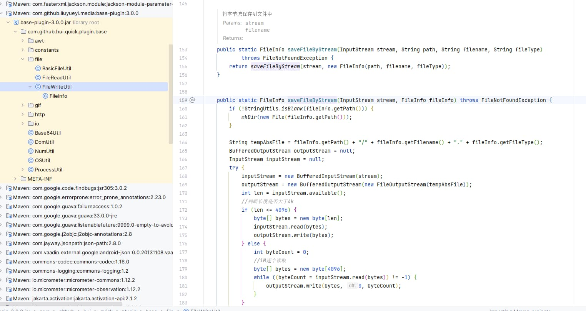

这个方法的参数构建中，stream可以直接使用传递的参数，重点就是文件保存路径、临时文件名、文件类型这三个参数的构建

**文件类型判断**

根据魔数来判断文件类型，这里可以同样可以借助`base-plugin`中的工具类来实现，具体代码逻辑如下

```java
private final String DEFAULT_FILE_TYPE = "txt";
private final Set<MediaType> STATIC_IMG_TYPE = new HashSet<>(Arrays.asList(MediaType.ImagePng, MediaType.ImageJpg, MediaType.ImageWebp, MediaType.ImageGif));

/**
 * 获取文件类型
 *
 * @param input
 * @param fileType
 * @return
 */
private String getFileType(ByteArrayInputStream input, String fileType) {
    if (StringUtils.isNotBlank(fileType)) {
        return fileType;
    }

    MediaType type = MediaType.typeOfMagicNum(FileReadUtil.getMagicNum(input));
    if (STATIC_IMG_TYPE.contains(type)) {
        return type.getExt();
    }
    return DEFAULT_FILE_TYPE;
}
```

接下来我们需要感的事情是将输入流转换位字节数组输入流，支持重复进行读取

```java
    /**
     * 保存图片到本地
     *
     * @param input
     * @param fileType
     * @return
     */
    public FileWriteUtil.FileInfo saveToFile(InputStream input, String fileType) {
        try {
            if (fileType == null) {
                // 根据魔数判断文件类型
                InputStream finalInput = input;
                byte[] bytes = StreamUtils.copyToByteArray(finalInput);
                input = new ByteArrayInputStream(bytes);
                fileType = getFileType((ByteArrayInputStream) input, fileType);
            }

            // ... 省略
        } catch (Exception e) {
            log.error("Parse img from httpRequest to BufferedImage error! e:", e);
            throw new RuntimeException(e);
        }
    }
```


**临时存储文件生成**

接下来就是定义我们的图片存储规则，一个简单的策略就是直接根据天进行归档，文件名则使用时间+随机数的方式来生成


```java
/**
 * 生成临时文件
 *
 * @return
 */
private FileWriteUtil.FileInfo genTmpFileName(String fileType) {
    FileWriteUtil.FileInfo file = new FileWriteUtil.FileInfo();
    file.setFileType(fileType);
    // 生成安天归档的文件名, 前面8位字符串为年月日，后面的为文件名
    String fileName = LocalDateTime.now().format(DateTimeFormatter.ofPattern("yyyyMMdd/HHmmssSSS")) + "_" + random.nextInt(100);
    String path = imageProperties.getAbsTmpPath() + imageProperties.getWebImgPath() + fileName.substring(0, 8);
    file.setPath(path);
    file.setFilename(fileName.substring(9));
    return file;
}
```

请注意，上面的path的绝对路径生成规则，我们采用配置的方式来定义，这里有两个定义参数

- absTmpPath: 表示本机临时保存的绝对地址
- webImgPath: 这个表示对外web访问路径

怎么理解这两个值？

举一个例子： 

- absTmpPath: d://tmp/storage
- webImgPath: /img/

那么一个上传的图片，假定再`2024/02/27`号上传的图片，实际保存的路径为： `d://tmp/storage/img/20240227/xxxx_xx.jpg`

我们返回给前端的处理后的图片访问路径则应该是: `/img/20240227/xxxx_xx.jpg`，当然这里还缺少一个访问的域名前缀


所以我们可以定义一个图片的属性类 `com.github.liuyueyi.ai.autormbg.service.ImageProperties`

```java
@Data
@Component
@ConfigurationProperties(prefix = "image")
public class ImageProperties {

    /**
     * 存储在服务器上绝对路径
     */
    private String absTmpPath;

    /**
     * 对外访问的web相对路径
     */
    private String webImgPath;

    /**
     * 访问图片的host
     */
    private String cdnHost;

    /**
     * 处理后的图片后缀
     */
    private String processImgSuffix;
}
```

对应的配置文件信息则可以是 `application.yml`

```yaml
image:
  abs-tmp-path: d://tmp/storage
  web-img-path: /img/
  cdn-host: http://127.0.0.1:8080
  process-img-suffix: _no_bg.png
```

这样我们就实现了本地图片的临时路径生成，因此完整的图片保存逻辑如下

```java
/**
 * 保存图片到本地
 *
 * @param input
 * @param fileType
 * @return
 */
public FileWriteUtil.FileInfo saveToFile(InputStream input, String fileType) {
    try {
        if (fileType == null) {
            // 根据魔数判断文件类型
            InputStream finalInput = input;
            byte[] bytes = StreamUtils.copyToByteArray(finalInput);
            input = new ByteArrayInputStream(bytes);
            fileType = getFileType((ByteArrayInputStream) input, fileType);
        }

        FileWriteUtil.FileInfo fileInfo = genTmpFileName(fileType);
        FileWriteUtil.FileInfo file = FileWriteUtil.saveFileByStream(input, fileInfo);
        return file;
    } catch (Exception e) {
        log.error("Parse img from httpRequest to BufferedImage error! e:", e);
        throw new RuntimeException(e);
    }
}

/**
 * 生成临时文件
 *
 * @return
 */
private FileWriteUtil.FileInfo genTmpFileName(String fileType) {
    FileWriteUtil.FileInfo file = new FileWriteUtil.FileInfo();
    file.setFileType(fileType);
    // 生成安天归档的文件名
    String fileName = LocalDateTime.now().format(DateTimeFormatter.ofPattern("yyyyMMdd/HHmmssSSS")) + "_" + random.nextInt(100);
    String path = imageProperties.getAbsTmpPath() + imageProperties.getWebImgPath() + fileName.substring(0, 8);
    file.setPath(path);
    file.setFilename(fileName.substring(9));
    return file;
}


/**
 * 获取文件类型
 *
 * @param input
 * @param fileType
 * @return
 */
private String getFileType(ByteArrayInputStream input, String fileType) {
    if (StringUtils.isNotBlank(fileType)) {
        return fileType;
    }

    MediaType type = MediaType.typeOfMagicNum(FileReadUtil.getMagicNum(input));
    if (STATIC_IMG_TYPE.contains(type)) {
        return type.getExt();
    }
    return DEFAULT_FILE_TYPE;
}
```

#### 3.4.2 抠图实现

当上面实现了图片存储之后，我们接下来则是访问pyhton服务，来实现抠图；再前面的python的接口定义中，有三个参数

- 图片名（带绝对地址）
- 图片类型
- 处理的图片后缀（即处理后的图片与原图片再同一个目录下，文件名前缀也一致）

返回处理后的图片地址


这里直接借助RestTemplate来实现交互，核心的逻辑如下


`com.github.liuyueyi.ai.autormbg.service.BgRemoveService#removeBg`


```java
private ImageProperties imageProperties;
@Value("${ai.url:http://127.0.0.1:8000/rmbg}")
private String aiUrl;

private Random random;
private RestTemplate restTemplate;


public BgRemoveService(ImageProperties imageProperties) {
    this.imageProperties = imageProperties;
    this.random = new Random();
    this.restTemplate = new RestTemplate();
}


/**
 * 移除图片背景
 *
 * @param mFile
 * @return
 * @throws IOException
 */
public String removeBg(MultipartFile mFile) throws IOException {
    FileWriteUtil.FileInfo file = saveToFile(mFile.getInputStream(), null);
    String path = file.getPath() + "/" + file.getFilename();

    String response = restTemplate.getForObject(aiUrl + "?name=" + path + "&type=" + file.getFileType() + "&outSuffix=" + imageProperties.getProcessImgSuffix(), String.class);
    String result = response.replaceAll("\"", "").replace(imageProperties.getAbsTmpPath(), imageProperties.getCdnHost());
    log.info("processImg: {} -> {}", file.getAbsFile(), result);
    return result;
}
```


#### 3.4.3 返回图片访问配置

到上面，一个自动抠图的服务就完成了；但是会发现我们返回的图片无法访问到，会出现404，这主要是因为直接返回的图片地址，并不能被识别

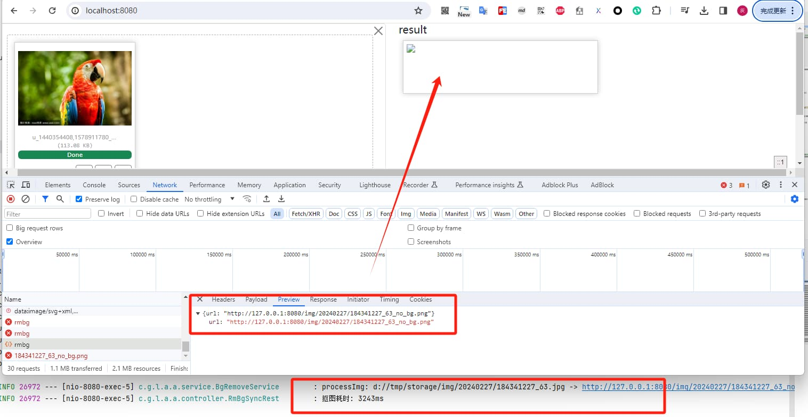

这里的处理方案有两种

- 返回base64的图片
- 配置静态资源目录

我们先看一下第二种方式，直接将生成的图片地址设置为web应用的静态资源目录，这样就可以直接通过web应用来访问图片了，对应的配置也比较简单，直接再`application.yml`文件中添加 `spring.web.resources.static-locations`

完整的配置信息如下

```yaml
spring:
  web:
    resources:
      # 支持本地图片上传之后的链接，其中 file:///d的用于win系统，后面的file: 适用于mac/linux系统
      static-locations:
        - classpath:/static/
        - file:///d:${image.abs-tmp-path}
        - file:${image.abs-tmp-path}
  thymeleaf:
    cache: false
    encoding: UTF-8
    servlet:
      content-type: text/html
    mode: HTML5

image:
  abs-tmp-path: d://tmp/storage
  web-img-path: /img/
  cdn-host: http://127.0.0.1:8080
  process-img-suffix: _no_bg.png
```

然后我们再来测试验证一下，看下执行效果如何

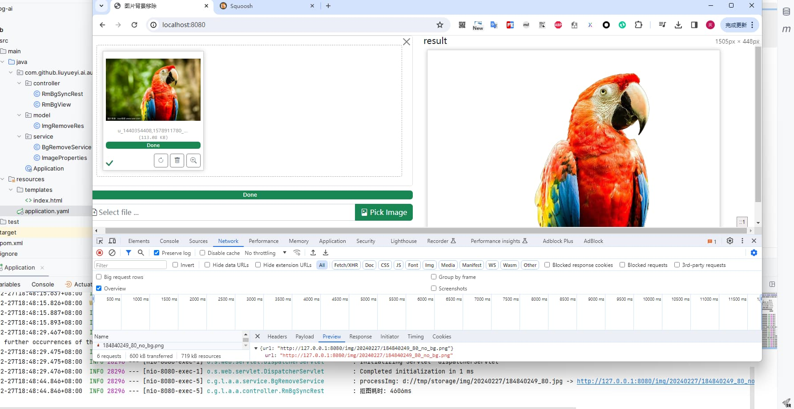


如果我们希望直接返回base64格式的图片，则可以调整一下返回的逻辑，核心逻辑在 `com.github.liuyueyi.ai.autormbg.service.BgRemoveService#removeBgBase64`

```java
public String removeBgBase64(MultipartFile mFile) throws IOException {
    FileWriteUtil.FileInfo file = saveToFile(mFile.getInputStream(), null);
    String path = file.getPath() + "/" + file.getFilename();

    String response = restTemplate.getForObject(aiUrl + "?name=" + path + "&type=" + file.getFileType() + "&outSuffix=" + imageProperties.getProcessImgSuffix(), String.class);
    response = response.replaceAll("\"", "");
    log.info("processImg: {}", file.getAbsFile());
    String result = Base64Util.encode(ImageIO.read(new File(response)), MediaType.ImagePng.getExt());
    return DomUtil.toDomSrc(result, MediaType.ImagePng);
}
```

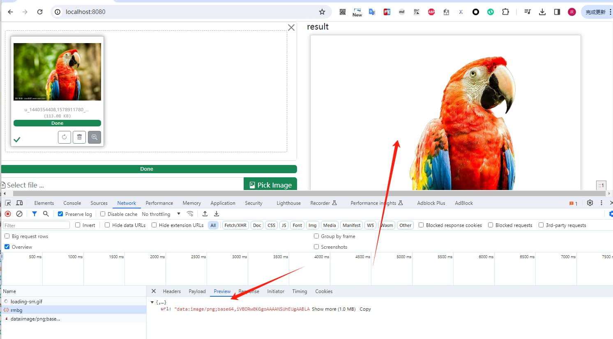

## 4. 小结

到这里，我们就已经实现了一个完整的自动抠图服务，其中主要利用到技术栈有：

- python
- java17+ & springboot3+

整体来说基本上就是基于现有的AI能力进行套壳，接下来我们可以在这个服务的基础之上做一些常识性的改造，以用到更多的知识点，比如

- SpringMVC替换为响应式的webflux架构
- 引入oss来处理图片的转存逻辑
- web应用通过命令行的方式调用python抠图服务
- 接口访问的限流（因为每个抠图耗时较高，如果并发较大，服务容易gg）
- 权限管控
- ...

