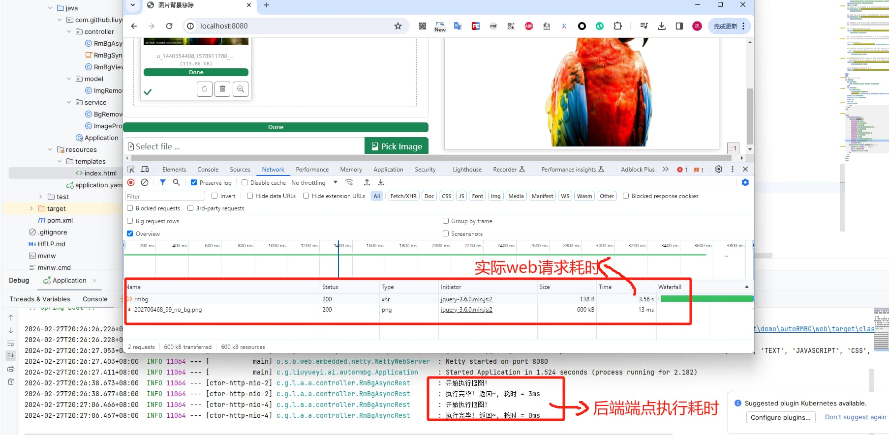
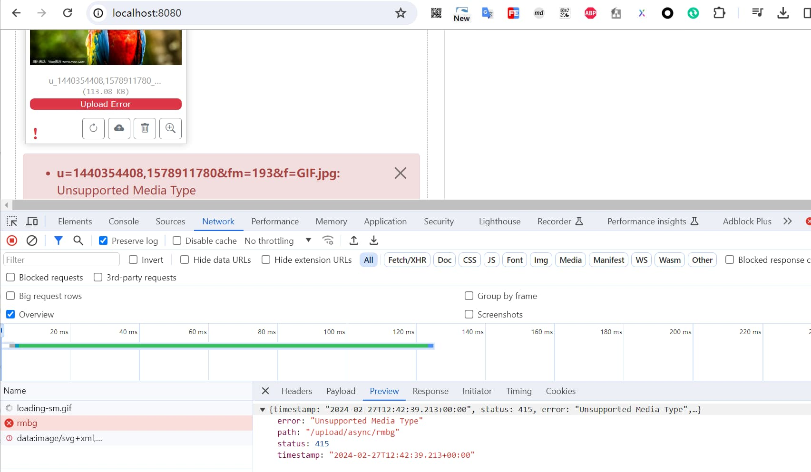
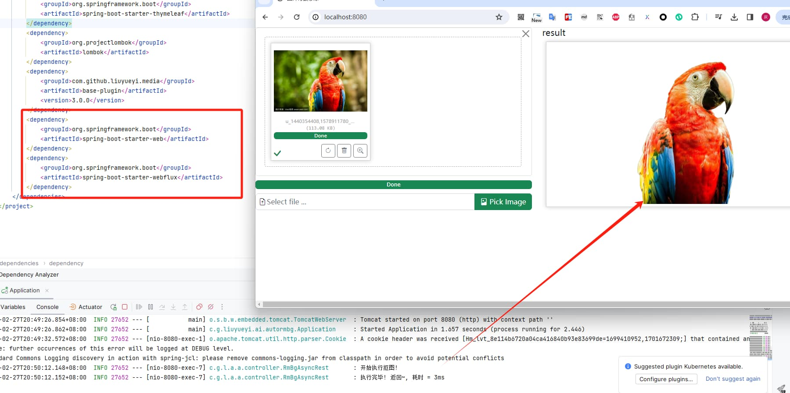

# 基于webflux的web抠图服务

上一篇博文 [从0到1实现一个自动抠图服务](./md/从0到1实现一个自动抠图服务.md) 从0到1演示了如何手撸一个自动抠图服务，接下来我们做一下升级改造，将之前的SpringMVC替换成webflux，提高响应能力


## 1. webflux改造

将SpringMVC替换成WebFlux，整体需要改动的点并不太多，在SpringMVC中我们常用的注解依然能用，只是需要注意一下参数的解析与返回的改造


### 1.1 配置依赖

再使用WebFlux，我们首先需要再`pom.xml`配置文件中添加上相关依赖，并移除web的依赖（后面说不移除的问题）

```xml
<dependencies>
    <dependency>
        <groupId>org.springframework.boot</groupId>
        <artifactId>spring-boot-starter-thymeleaf</artifactId>
    </dependency>
    <dependency>
        <groupId>org.projectlombok</groupId>
        <artifactId>lombok</artifactId>
    </dependency>
    <dependency>
        <groupId>org.springframework.boot</groupId>
        <artifactId>spring-boot-starter-webflux</artifactId>
    </dependency>
    <dependency>
        <groupId>com.github.liuyueyi.media</groupId>
        <artifactId>base-plugin</artifactId>
        <version>3.0.0</version>
    </dependency>
</dependencies>
```

### 1.2 WEB端点新增

接下来我们新增一个WebFlux的异步抠图端点

```java
@Slf4j
@RestController
public class RmBgAsyncRest {
    @Autowired
    private BgRemoveService bgRemoveService;

    @PostMapping(path = "upload/async/rmbg", produces = MediaType.APPLICATION_JSON_VALUE)
    public Mono<ImgRemoveRes> rmImgBg(@RequestPart("img") FilePart file) {
        StopWatch stopWatch = new StopWatch();
        stopWatch.start("抠图");
        log.info("开始执行抠图!");
        Mono<ImgRemoveRes> res = bgRemoveService.removeBgAsync(file)
                .flatMap(s -> Mono.just(new ImgRemoveRes(s)))
                .onErrorResume(Mono::error);
        stopWatch.stop();
        log.info("执行完毕! 返回~, 耗时 = {}ms", stopWatch.getTotalTimeMillis());
        return res;
    }
}
```

注意上面的实现，相比较于SpringMVC的上传，这里变动有两点

1. 参数接收：使用`@RequestPart("img") FilePart file`来接收上传的图片
2. 抠图服务：`bgRemoveService.removeBgAsync`返回的是一个Mono对象，我们直接返回的也是一个Mono封装对象


### 1.3 异步抠图服务

接下来再看一下异步抠图服务的变更，同样是之前的两步骤的调整

**图片保存**

将接收到的图片保存到本地

```java
// 将图片保存到本地
Mono<FileWriteUtil.FileInfo> fileInfo = DataBufferUtils.join(filePart.content()).flatMap(
        dataBuffer -> {
            byte[] bytes = new byte[dataBuffer.readableByteCount()];
            dataBuffer.read(bytes);
            DataBufferUtils.release(dataBuffer); // 释放内存
            return Mono.just(bytes);
        }
).map(fileBytes -> saveToFile(fileBytes, null));
```

上面首先是将接收的流转换位字节数组，然后将其保存到本地，因此需要调整一下文件保存的方法，将之前流的保存调整为字节数组的保存

```java
public FileWriteUtil.FileInfo saveToFile(byte[] bytes, String fileType) {
    try {
        ByteArrayInputStream stream = new ByteArrayInputStream(bytes);
        if (fileType == null) {
            fileType = getFileType(stream, fileType);
        }

        FileWriteUtil.FileInfo fileInfo = genTmpFileName(fileType);
        FileWriteUtil.FileInfo file = FileWriteUtil.saveFileByStream(stream, fileInfo);
        return file;
    } catch (Exception e) {
        log.error("Parse img from httpRequest to BufferedImage error! e:", e);
        throw new RuntimeException(e);
    }
}
```

**抠图服务访问**

之前我们使用RestTemplate来做同步的抠图访问，到了webflux，我们则需要切换成webclient来发起http请求了，其使用姿势同样比较简单

```java

private WebClient webClient;

public BgRemoveService(ImageProperties imageProperties) {
    this.imageProperties = imageProperties;
    this.random = new Random();
    this.restTemplate = new RestTemplate();
    this.webClient = WebClient.create();
}


// 续接上面的图片本地保存
// 图片背景移除
return fileInfo.flatMap(file -> {
    String path = file.getPath() + "/" + file.getFilename();
    String url = aiUrl + "?name=" + path + "&type=" + file.getFileType() + "&outSuffix=" + imageProperties.getProcessImgSuffix();
    return webClient.method(HttpMethod.GET)
            .uri(url)
            .retrieve()
            .bodyToMono(String.class)
            .map(response -> response.replaceAll("\"", "").replace(imageProperties.getAbsTmpPath(), imageProperties.getCdnHost()));
});
```


然后完整的抠图服务实现逻辑替换成

```java
/**
 * 图片移除
 *
 * @param filePart
 * @return
 */
public Mono<String> removeBgAsync(FilePart filePart) {
    // 将图片保存到本地
    Mono<FileWriteUtil.FileInfo> fileInfo = DataBufferUtils.join(filePart.content()).flatMap(
            dataBuffer -> {
                byte[] bytes = new byte[dataBuffer.readableByteCount()];
                dataBuffer.read(bytes);
                DataBufferUtils.release(dataBuffer); // 释放内存
                return Mono.just(bytes);
            }
    ).map(fileBytes -> saveToFile(fileBytes, null));

    // 图片背景移除
    return fileInfo.flatMap(file -> {
        String path = file.getPath() + "/" + file.getFilename();
        String url = aiUrl + "?name=" + path + "&type=" + file.getFileType() + "&outSuffix=" + imageProperties.getProcessImgSuffix();
        return webClient.method(HttpMethod.GET)
                .uri(url)
                .retrieve()
                .bodyToMono(String.class)
                .map(response -> response.replaceAll("\"", "").replace(imageProperties.getAbsTmpPath(), imageProperties.getCdnHost()));
    });
}
```

### 1.4 访问验证

再启动应用之前，先将之前的`RmBgSyncRest`类注释掉，避免影响应用的启动；然后再修改一下前端页面的接口访问地址

```js
    $(document).ready(function () {
        $("#input-id").fileinput({
            previewFileType: "image",
            browseClass: "btn btn-success",
            browseLabel: "Pick Image",
            browseIcon: "<i class=\"bi-file-image\"></i> ",
            removeClass: "btn btn-danger",
            removeLabel: "Delete",
            removeIcon: "<i class=\"bi-trash\"></i> ",
            uploadClass: "btn btn-info",
            uploadLabel: "Submit",
            uploadIcon: "<i class=\"bi-upload\"></i> ",
            uploadUrl: "/upload/async/rmbg", // 上传的url
            uploadAsync: true, // 异步上传
        }).on("fileuploaded", function (event, data) { //异步上传成功后回调
            console.log("返回结果:", data);		//data为返回的数据
            const res = data.response;
            $('#output').attr("src", res.url);
        });
    });
```

自动抠图表现形式如下




从上面后台的执行耗时日志输出可以看出，后端端点的耗时较小，基本上就是直接返回了


## 2. 踩坑

接下来再看一下再切换webflux的过程中遇到的坑，当我们新引入WebFlux但是没有移除SpringMVC时，再上传图片的时候，会抛一个类型不支持的异常





```json
{
    "timestamp": "2024-02-27T12:42:39.213+00:00",
    "status": 415,
    "error": "Unsupported Media Type",
    "path": "/upload/async/rmbg"
}
```

问题的主要原因在于SpringMVC主要是基于servlet构建的web应用，而webflux则是基于reactive，两者之间存在冲突

> [Can Spring webflux be used along with spring web mvc project? - Stack Overflow](https://stackoverflow.com/questions/76700598/can-spring-webflux-be-used-along-with-spring-web-mvc-project)

因此当我们的应用，同时引入springMVC 和 WebFlux时，我们可以通过手动指定的方式来解决这个问题

调整启动入口

```java
@SpringBootApplication
public class Application {
    public static void main(String[] args) {
        new SpringApplicationBuilder(Application.class).web(WebApplicationType.REACTIVE).run(args);
    }
}
```

再次访问验证一下，可以正常处理





## 3. 小结

本文主要是再之前的基础上，对SpringMVC进行改造，由WebFlux来替换传统的阻塞性webmvc，同样实现了自动抠图服务，而且最直观的表现则是后端端点的响应很快，至于这个快，是否真的对应用性能有影响呢？且看后续的分析

