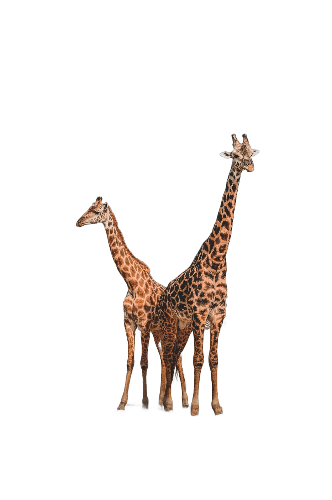

# BRIA Background Removal v1.4 Model Card

This REPO IS A FORK OF https://huggingface.co/briaai/RMBG-1.4

## 安装

win 环境环境安装

```bash
python3.11 -m venv venv

.\venv\Scripts\pip.exe install -r .\requirements.txt  -i https://pypi.tuna.tsinghua.edu.cn/simple
```

linux/mac 环境安装

```bash
python3.11 -m venv venv

./venv/bin/pip install -r ./requirements.txt  -i https://pypi.tuna.tsinghua.edu.cn/simple
```

验证是否成功

```bash
# mac/linux
venv/bin/python3 demo.py

# win
.\venv\Scripts\python.exe .\demo.py
```

查看output下的输出

| 原图                                 | 输出                             |
|------------------------------------|--------------------------------|
|          |  |
|  |    |

## 启动

启动命令

```bash
# mac/linux
venv/bin/python3 main.py

# win
.\venv\Scripts\python.exe .\main.py
```

启动之后，可以看到如下的输出


测试: 浏览器点击 👉 [http://127.0.0.1:8000/rmbg?name=dog](http://127.0.0.1:8000/rmbg?name=dog)

```bash
curl http://127.0.0.1:8000/rmbg?name=dog
```
